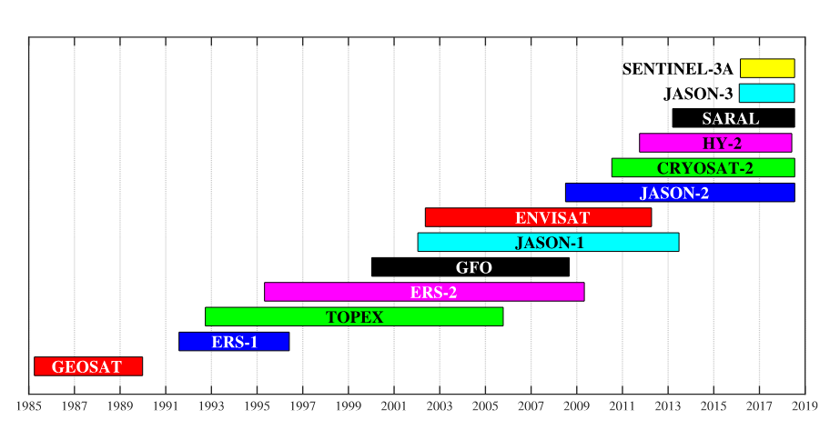

# Ocean-Data-Sources
A description of data ocean data sources, high level exploration, and how to access them

| Dataset name | Provider / Source | Description | Temporal coverage | Accessible | Paywall | Link | Notes |
|--------------|-------------------|-------------|-------------------|------------|---------|------|-------|
| ERA5 | ECMWF / Copernicus Climate Change Service (C3S) | Global atmospheric and ocean surface reanalysis providing consistent climate variables | 1940–present (hourly) | ✅ | ❌ | [...](https://cds.climate.copernicus.eu/datasets/reanalysis-era5-single-levels?tab=overview) | Ocean variables include $H_s$, $T_p$, and u/v wind components; note ocean and wind resolutions differ |
| Altimeter | AODN (AWS) | Global wind and $Hs$ observations | 1985 - present | ✅ | ❌ | [...](https://portal.aodn.org.au/search) | $H_s$ and wind (still need to confirm) |

## Brief Exploration
- **ERA5:** `era5.ipynb`
- **Altimeter:** `altimeter.ipynb`

## Data Source Notes

### ERA5 
ERA5 is a comprehensive reanalysis dataset spannning 1940-present at an hourly resolution. Updates to the dataset occur daily a latency of 5 days. An article titled [*The ERA5 global reanalysis*](https://rmets.onlinelibrary.wiley.com/doi/10.1002/qj.3803) describes the dataset. Note, that key variables of atmospheric wind and ocean waves relevant for oceanographic/ forecasting exist on different grid resolutions. ocean waves wave data has a resolution of $0.5^\circ \times 0.5^\circ$, while atmospheric variables such as `u10` and `v10` (10m wind) have a $0.25^\circ \times 0.25^\circ$ resolution.

### Wind-Wave Altimeter
Please note the information for this section is sourced from the Data Paper titled [*33 years of globally calibrated wave height and wind speed data based on altimeter observations*](https://www.nature.com/articles/s41597-019-0083-9).

The dataset contains global wind speed and wave height data from all altimeter missions (SENTINAL-3B, SARAL, etc) which have flow from 1985 - current, as shown in the below figure. The dataset has been calibrated against the NDBC buoy data. Altimeter observations trace-out a traditional herring bone ground-track pattern. 

Altimeters are nadir satelites (instruments designed with sensors pointing towards the Earth's surface). The sensor's use a narrow beam of approximately 10 km foot print. The ground-track resolution is high, sampled at 1 Hz (one measurement per second). This temporal resolution coupled with a moving satelite (referred to as ground-track speed) at approximately 6-7 km/s, produces a resolution of 7 km (ground track speed x sampling interval). The ground tracks are repeated on a 3-10 day repeat cycle.

The dataset is available through [AODN](https://portal.aodn.org.au/search) under the dataset titled *IMOS - Satellite Remote Sensing - Surface Waves Sub-Facility - altimeter wave/wind*. The dataset is decomposed into individual spatial squares of observations, over a select time span per satelite. Here is a filename for example: `https://imos-data.s3-ap-southeast-2.amazonaws.com/IMOS/SRS/Surface-Waves/Wave-Wind-Altimetry-DM00/SENTINEL-3B/060S_300E/`

Figure sourced from *33 years of globally calibrated wave height and wind speed data based on altimeter observations*.